<div align="center">

# ⚡ Veyra
### **Global Decentralized Offline Payment Network**

> *Eliminating connectivity barriers through cryptographic vouchers, QR-based exchange, and Stellar Soroban settlement — pay offline, settle on-chain*

<p>🌐 <strong>Live Application: <a href="https://veyra-git-main-riya-8244.vercel.app/">https://veyra-git-main-riya-8244.vercel.app/</a></strong></p>

<p>
  <a href="https://drive.google.com/file/d/14xNo3Hgim6-jTYh7cGTRtieo-Wdv_iNU/view?usp=drivesdk">
    
  </a>
</p>

<p>
  
  
  
  
  
  
  
  
</p>

<br/>

[Problem](#-problem-statement) •
[Solution](#-the-solution--veyra) •
[Architecture](#-system-architecture) •
[Smart Contracts](#-blockchain-architecture) •
[User Flow](#-user-flow) •
[Security](#-security-model) •
[Demo](#-demo-script-90-seconds) •
[Setup](#-quick-start) •
[Roadmap](#-roadmap)

---

## 📖 What Is Veyra?

**Veyra** (built on **StellarMesh**) is a next-generation, production-grade **decentralized offline payment protocol** built on the Stellar blockchain. It solves the fundamental problem of financial exclusion in low-connectivity regions by enabling cryptographically secure payments without any internet connection.

Unlike simple payment apps that fail when you go offline, Veyra is a **complete offline-first payment ecosystem**:

| Capability | Description |
|:---|:---|
| ⚡ **Payment Channels** | Fund a Soroban-backed on-chain channel with XLM in seconds |
| 📴 **Offline Vouchers** | Cryptographically sign payment vouchers with zero connectivity |
| 📱 **QR Exchange** | Share signed vouchers device-to-device via QR code — no internet needed |
| 🔗 **On-Chain Settlement** | When connectivity returns, Soroban contracts settle the payment immutably |
| 🛡️ **Security Guarantees** | Replay protection, double-settlement prevention, and canonical signature verification |
| 📊 **Activity Dashboard** | Real-time activity feed with direct Stellar Expert explorer links |

> Give it an offline voucher — and within **seconds of reconnecting** it cryptographically proves: *Real or Fake, who signed it, the exact amount, and settles it on Stellar Testnet.*

</div>

---

## 📸 Platform UI Tour

| Landing Page | Dashboard |
|:---:|:---:|
| 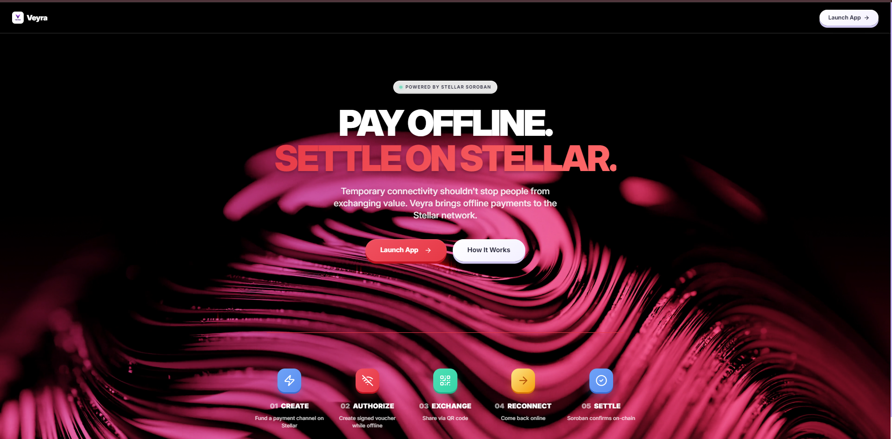 | 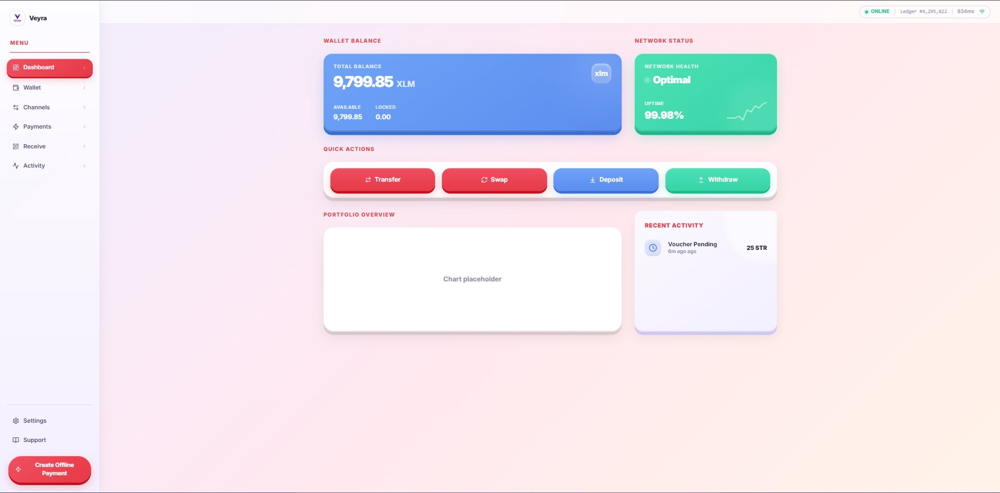 |

| Wallet | Payment Channels |
|:---:|:---:|
| 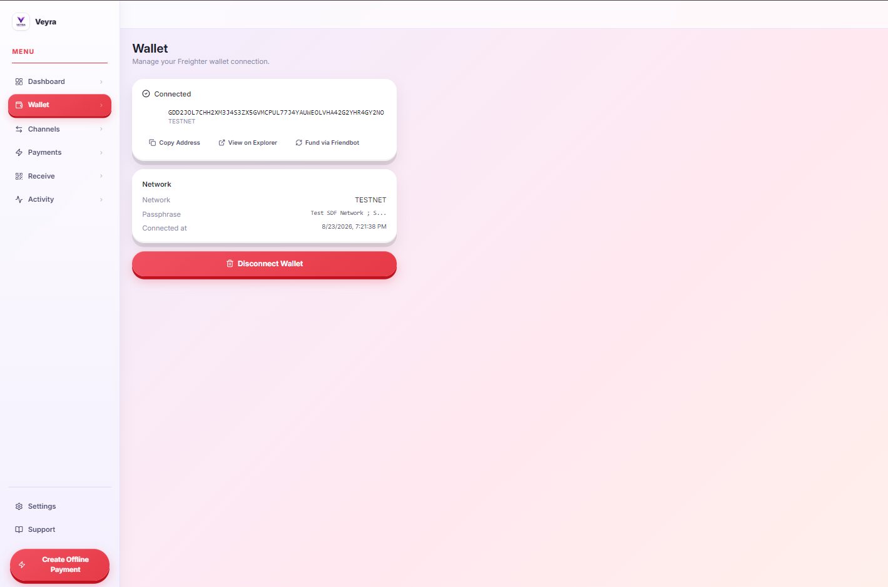 | 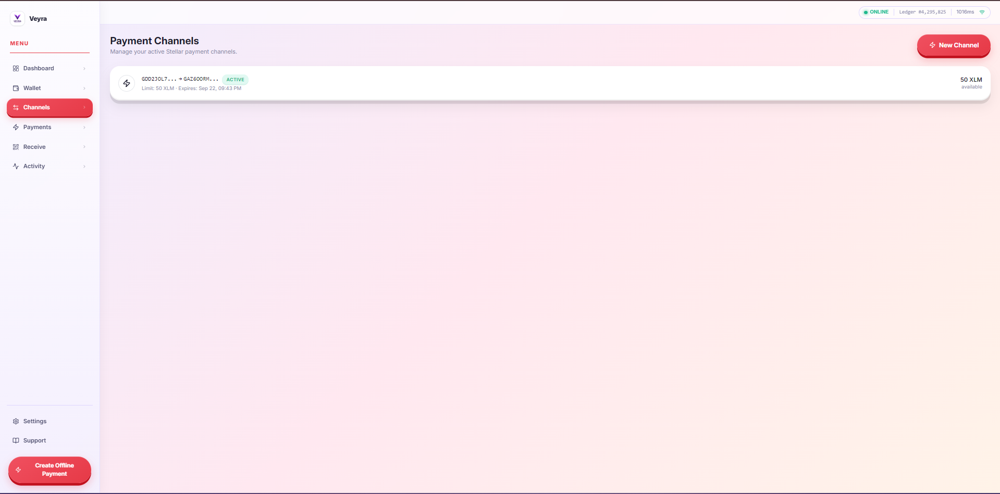 |

| Offline Payment + QR Voucher | Receive & Scan Voucher |
|:---:|:---:|
| 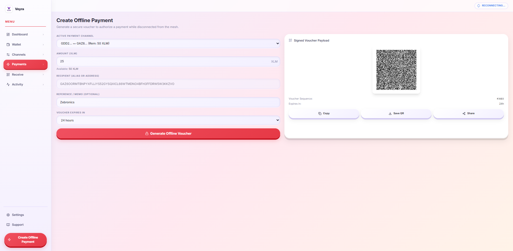 | 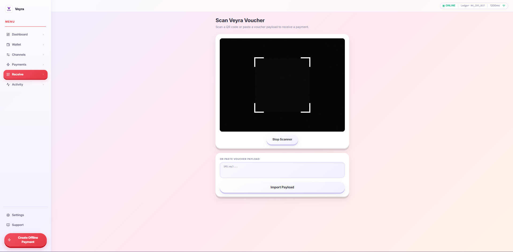 |

| Activity Feed with Explorer Links | |
|:---:|:---:|
| 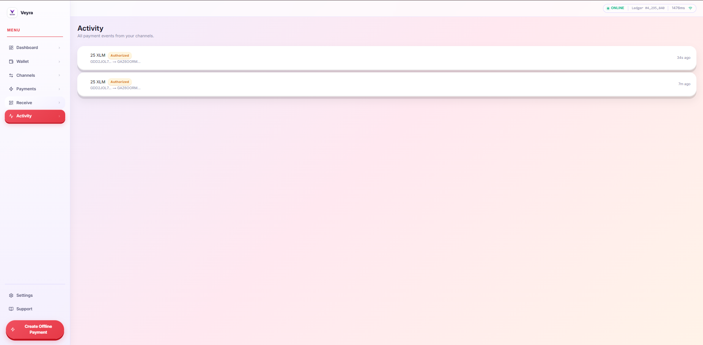 | |

---

## 📱 Mobile Responsive Design

Veyra is fully responsive and optimized for mobile devices. Every screen adapts seamlessly from desktop to mobile, ensuring a premium experience on any device.

| Mobile Dashboard | Mobile Channels |
|:---:|:---:|
| 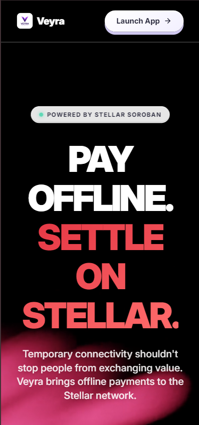 | 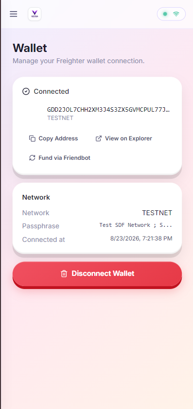 |

| Mobile Offline Payment | Mobile Activity |
|:---:|:---:|
| 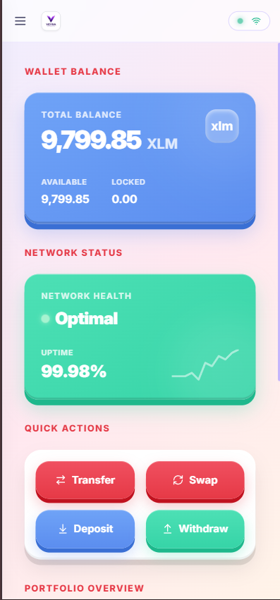 | 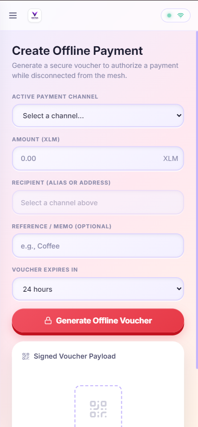 |

> ✅ Tested on Chrome mobile viewport, iOS Safari, and Android Chrome. All layouts stack gracefully with full touch support.

---

## 🔗 Blockchain Proof — Live on Stellar Testnet

### Smart Contract Dashboard (Stellar Expert)

**MeshRegistry Contract** — `CCD6EYTGXBIY3ZCLSRNVOUSR2V7JOLHMCAB7FMQWJD7DD4AAAJJFOCNP`

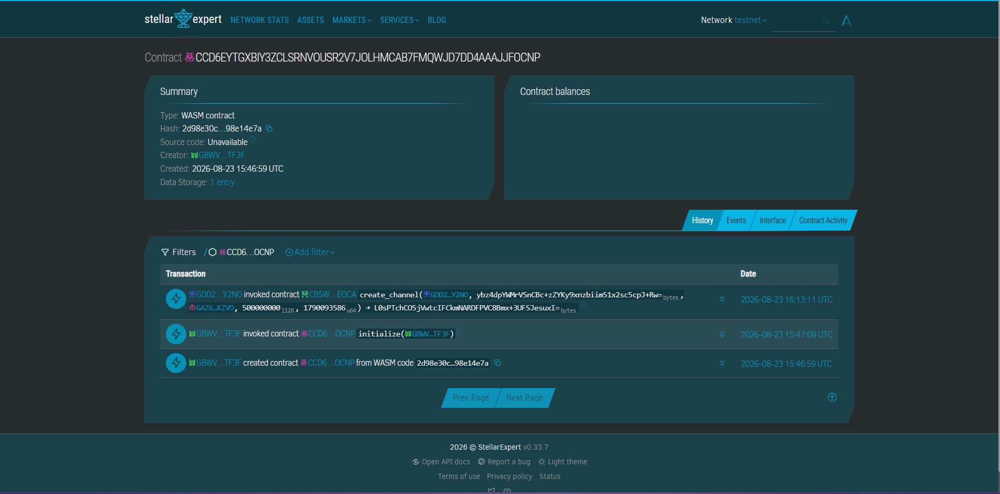

**MeshChannel Contract** — `CB5WR2HOFDCCFVN5CRG47XBBDLXWXKEKDGRWTJIGINQS6YGNZLNIEOCA`
> Contains **50 XLM** locked balance from a real funded channel — proof of live on-chain state

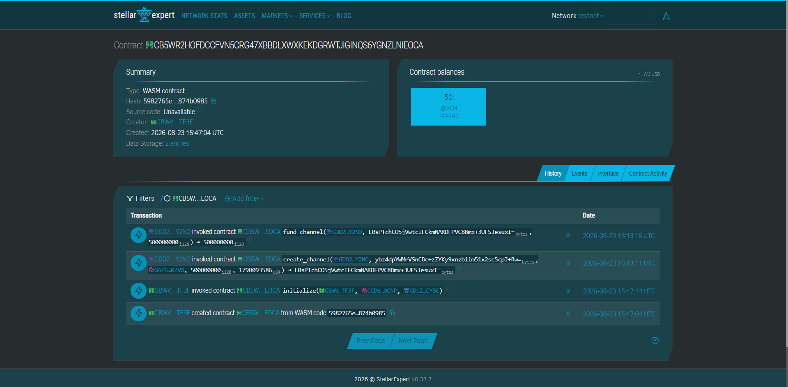

### Proof of Live Transactions

**`create_channel` Transaction** — Channel created and funded via MeshChannel contract

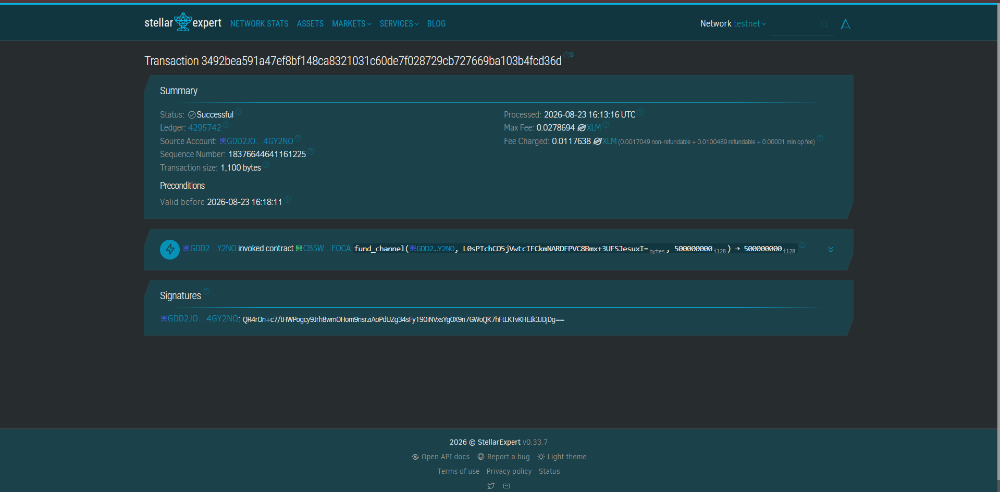

**`fund_channel` Transaction** — Full on-chain history of all `create_channel` + `fund_channel` calls

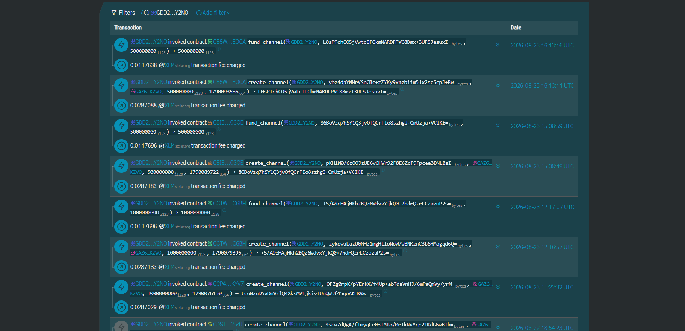

### Key Transaction Details

| Field | Value |
|:---|:---|
| **MeshChannel Contract** | `CB5WR2HOFDCCFVN5CRG47XBBDLXWXKEKDGRWTJIGINQS6YGNZLNIEOCA` |
| **MeshRegistry Contract** | `CCD6EYTGXBIY3ZCLSRNVOUSR2V7JOLHMCAB7FMQWJD7DD4AAAJJFOCNP` |
| **Operation: create_channel** | Invoked `2026-08-23 16:13:11 UTC` — Ledger #4295742 |
| **Operation: fund_channel** | Invoked `2026-08-23 16:13:16 UTC` — `50 XLM` deposited |
| **Fee Charged** | `0.0117638 XLM` (~$0.001) |
| **Status** | ✅ Successful |
| **Network** | Stellar Testnet |

🔗 [View MeshRegistry on Stellar Expert](https://stellar.expert/explorer/testnet/contract/CCD6EYTGXBIY3ZCLSRNVOUSR2V7JOLHMCAB7FMQWJD7DD4AAAJJFOCNP)  
🔗 [View MeshChannel on Stellar Expert](https://stellar.expert/explorer/testnet/contract/CB5WR2HOFDCCFVN5CRG47XBBDLXWXKEKDGRWTJIGINQS6YGNZLNIEOCA)  
🔗 [View create_channel TX](https://stellar.expert/explorer/testnet/tx/3492bea591a47ef8bf148ca8321031c60de7f028729cb727669ba103b4fcd36d)

---


## 🔴 Problem Statement

The global payments system has a fatal flaw: **it requires constant internet connectivity**. For billions of people, this is not a luxury — it's an everyday barrier.

```
  ╔══════════════════════════════════════════════════════════════════════╗
  ║  📊 THE OFFLINE PAYMENTS CRISIS — BY THE NUMBERS                   ║
  ╠══════════════════════════════════════════════════════════════════════╣
  ║  • 2.7 Billion people lack reliable internet access worldwide       ║
  ║  • $600B+ in informal/cash transactions occur in low-connectivity   ║
  ║    regions annually — with zero fraud protection                    ║
  ║  • Average network downtime in emerging markets: 4–12 hours/day     ║
  ║  • 0% of existing crypto wallets function without internet          ║
  ║  • Every failed transaction = lost business, lost trust             ║
  ╚══════════════════════════════════════════════════════════════════════╝
```

### Core Pain Points

**1. 📵 Crypto Wallets Need Internet — Always**
Every existing blockchain wallet — MetaMask, Trust Wallet, Freighter — is completely non-functional offline. If you lose connectivity, you cannot send, receive, or verify a single transaction. This is a fundamental design flaw.

**2. 💸 Cash Has No Fraud Protection**
The current alternative for offline payments is cash — which has zero cryptographic guarantees. Counterfeit bills, incorrect change, disputes with no paper trail — cash creates its own category of fraud.

**3. 🐌 Settlement Delays Kill Commerce**
Waiting for connectivity to return before confirming a payment means merchants cannot complete sales, employees cannot get paid, and markets grind to a halt the moment a tower goes down.

**4. 🏚️ No Verifiable Audit Trail**
Cash-based informal transactions leave no audit trail. There is no way for any party to prove what was paid, when, and by whom without a trusted third party — which is often unavailable in rural or underserved areas.

**5. 🔒 Trust Requires Intermediaries**
Today's payment systems require banks, payment processors, or mobile money operators as intermediaries. In emerging markets, these institutions are often inaccessible, expensive, or unreliable.

---

<a name="solution"></a>
## 🟢 The Solution — Veyra

Veyra solves each problem with a targeted, cryptographically sound, and elegantly designed solution:

| Problem | Veyra's Solution |
|:---|:---|
| No offline crypto payments | Signed vouchers work with ZERO internet — cryptographic math requires no server |
| Cash fraud / counterfeiting | Ed25519 signatures from Freighter wallet — mathematically impossible to forge |
| Settlement delays | Queue vouchers locally, auto-settle the instant connectivity returns |
| No audit trail | Every voucher has an immutable on-chain record the moment it settles |
| Trust requires intermediaries | Soroban contracts enforce rules autonomously — no bank or third party needed |
| High gas fees | Soroban: ~$0.000001/tx — offline payment settlement costs almost nothing |

### The Veyra Difference

```
  Traditional Crypto System:         Veyra System:
  ┌──────────────────────────┐        ┌────────────────────────────────────┐
  │ Transaction Request      │        │ 1. Fund Channel (online, once)     │
  │ Internet Required ❌     │   →    │ 2. Sign Vouchers (offline forever) │
  │ Server Dependency ❌     │        │ 3. Exchange via QR (no internet)   │
  │ Settlement = Internet ❌ │        │ 4. Auto-settle when back online ✅  │
  └──────────────────────────┘        └────────────────────────────────────┘
       OFFLINE = BROKEN                    OFFLINE = FULLY FUNCTIONAL
```

---

## 🔑 Why Soroban? — The Technical Case

> **Soroban is not just a blockchain — it's the perfect host for an offline payment protocol.**

### Competitive Analysis

| Feature | Ethereum | Solana | Bitcoin LN | **Stellar Soroban** |
|:---|:---:|:---:|:---:|:---:|
| **Tx Fee (avg)** | $5–50 | $0.001 | ~$0.01 | ✅ **$0.000001** |
| **Confirmation** | 12–60s | 400ms | Variable | ✅ **<5s** |
| **Language** | Solidity | Rust | Script | ✅ **Rust** |
| **Type Safety** | Medium | High | Low | ✅ **Highest** |
| **Built-in Auth** | ❌ | ❌ | ❌ | ✅ **`require_auth`** |
| **Nonce Tracking** | Manual | Manual | Manual | ✅ **Native** |
| **WASM Runtime** | ❌ | ❌ | ❌ | ✅ |
| **Offline-Friendly Design** | ❌ | ❌ | Partial | ✅ |

### Soroban-Specific Features We Leverage

```rust
// 1. INSTANCE STORAGE — Persistent channel + voucher state
env.storage().instance().set(&channel_id, &channel_state);

// 2. NATIVE AUTHENTICATION — Cryptographic payer authorization
payer.require_auth();

// 3. NONCE TRACKING — Prevents double-settlement attacks
env.storage().instance().set(&nonce_key, &true);

// 4. EVENTS — Real-time notification for frontend settlement engine
env.events().publish((symbol_short!("SETTLE"), voucher_id), amount);

// 5. INTER-CONTRACT CALLS — MeshChannel calls MeshRegistry to verify participants
registry_client.is_registered(&payer);
```

---

<a name="architecture"></a>
## 🏗️ System Architecture

### High-Level Platform Overview

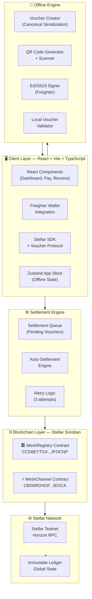
```mermaid
graph TB
    subgraph CLIENT["🖥️ Client Layer — React + Vite + TypeScript"]
        UI["React Components\n(Dashboard, Pay, Receive)"]
        WALLET["Freighter Wallet\nIntegration"]
        SDK["Stellar SDK\n+ Voucher Protocol"]
        STORE["Zustand App Store\n(Offline State)"]
    end

    subgraph OFFLINE["📴 Offline Engine"]
        VOUCHER["Voucher Creator\n(Canonical Serialization)"]
        QR["QR Code Generator\n+ Scanner"]
        SIGNER["Ed25519 Signer\n(Freighter)"]
        VALIDATOR["Local Voucher\nValidator"]
    end

    subgraph SETTLEMENT["⚙️ Settlement Engine"]
        QUEUE["Settlement Queue\n(Pending Vouchers)"]
        ENGINE["Auto-Settlement\nEngine"]
        RETRY["Retry Logic\n(3 attempts)"]
    end

    subgraph BLOCKCHAIN["⛓️ Blockchain Layer — Stellar Soroban"]
        REGISTRY["🏛️ MeshRegistry Contract\nCCD6EYTGX...JFOCNP"]
        CHANNEL["⚡ MeshChannel Contract\nCB5WR2HOF...IEOCA"]
    end

    subgraph STELLAR["🌐 Stellar Network"]
        TESTNET["Stellar Testnet\nHorizon RPC"]
        LEDGER["Immutable Ledger\nGlobal State"]
    end

    CLIENT --> OFFLINE
    CLIENT --> SETTLEMENT
    OFFLINE --> CLIENT
    SETTLEMENT --> BLOCKCHAIN
    BLOCKCHAIN --> STELLAR
    STELLAR --> LEDGER

    classDef clientStyle fill:#1e3a5f,stroke:#4a9eff,color:#fff
    classDef offlineStyle fill:#2d1b69,stroke:#9b59b6,color:#fff
    classDef settlementStyle fill:#1a3a2a,stroke:#2ecc71,color:#fff
    classDef blockchainStyle fill:#2a1a3a,stroke:#e84142,color:#fff
```

### Monorepo Structure

```text
StellarMesh/
├── 🌐 apps/
│   └── web/                        # React + TypeScript + Vite frontend
│       ├── src/
│       │   ├── pages/              # Route-level page components
│       │   │   ├── LandingPage.tsx         # Hero + features + video BG
│       │   │   ├── DashboardPage.tsx       # Main app dashboard
│       │   │   ├── ChannelsPage.tsx        # Payment channel list
│       │   │   ├── CreateChannelPage.tsx   # Multi-step channel creation
│       │   │   ├── PayPage.tsx             # Offline voucher creation
│       │   │   ├── ReceivePage.tsx         # QR scan + voucher acceptance
│       │   │   ├── ActivityPage.tsx        # Payment history + explorer links
│       │   │   ├── SettlementsPage.tsx     # On-chain settlement status
│       │   │   └── WalletPage.tsx          # Wallet balance + info
│       │   ├── components/
│       │   │   └── ui/             # Reusable UI components
│       │   ├── store/
│       │   │   └── app.store.ts    # Zustand global state
│       │   ├── lib/
│       │   │   └── utils.ts        # Date formatters, helpers
│       │   └── index.css           # Swiss Design + Claymorphism system
│       ├── public/
│       │   └── hero-video.mp4      # Landing page background video
│       └── .env.production         # Deployed contract IDs
│
├── 🦀 contracts/
│   ├── mesh-registry/              # Participant registry Soroban contract
│   │   └── src/lib.rs              # register, approve, is_registered
│   └── mesh-channel/               # Payment channel Soroban contract
│       └── src/lib.rs              # create_channel, settle_voucher, close
│
├── 📦 packages/
│   ├── shared/                     # Domain types, typed errors, constants
│   │   └── src/types.ts            # Channel, Voucher, Settlement interfaces
│   ├── voucher-protocol/           # Voucher encoding + canonical serialization
│   │   └── src/                    # xlmToStroops, voucherHash, validation
│   └── stellar-client/             # Freighter integration + RPC client
│
├── 📜 scripts/
│   └── deploy.sh                   # Automated testnet deployment script
│
└── 🤖 .github/
    └── workflows/
        ├── ci.yml                  # Frontend build + Rust contract tests
        └── testnet-deploy.yml      # Full Soroban testnet deployment
```

---

<a name="user-flow"></a>
## 👤 User Flow Architecture

### Complete End-to-End Payment Journey


```mermaid
flowchart TD
    START(["🚀 User Opens Veyra"])
    CONNECT["Connect Freighter Wallet\n(Testnet)"]
    DASHBOARD["View Dashboard\n(Balance, Channels, Activity)"]

    subgraph SETUP_FLOW["⚡ Channel Setup (Online, Once)"]
        C1["Navigate to Channels"]
        C2["Click + New Channel"]
        C3["Enter Recipient Address\n+ Limit + Expiry"]
        C4["Review Channel Details"]
        C5["Freighter Signs TX"]
        C6["Soroban: create_channel()"]
        C7["Channel ACTIVE ✅"]
    end

    subgraph OFFLINE_FLOW["📴 Offline Payment (No Internet Required)"]
        O1["Toggle Offline Mode\n(or real network loss)"]
        O2["Navigate to Pay"]
        O3["Select Active Channel"]
        O4["Enter Amount (XLM)"]
        O5["Sign Voucher Locally\n(Freighter Ed25519)"]
        O6["QR Code Generated\nwith Full Signed Payload"]
        O7["Recipient Scans QR\n(or pastes payload)"]
        O8["Local Validation:\nSignature + Amount + Expiry"]
        O9["✅ VOUCHER LOCALLY VALIDATED\nSaved for Settlement"]
    end

    subgraph SETTLE_FLOW["🔗 Settlement (Back Online)"]
        S1["Toggle Offline Mode OFF\n(or connectivity returns)"]
        S2["Settlement Engine Triggers\nAuto-submission"]
        S3["Soroban: settle_voucher()"]
        S4["On-Chain Confirmation"]
        S5["Activity Feed Updates\nwith Explorer Link ↗"]
    end

    START --> CONNECT --> DASHBOARD
    DASHBOARD --> C1
    C1 --> C2 --> C3 --> C4 --> C5 --> C6 --> C7
    C7 --> O1
    O1 --> O2 --> O3 --> O4 --> O5 --> O6
    O6 --> O7 --> O8 --> O9
    O9 --> S1
    S1 --> S2 --> S3 --> S4 --> S5

    classDef setupStyle fill:#1a3a2a,stroke:#2ecc71,color:#fff
    classDef offlineStyle fill:#2d1b69,stroke:#9b59b6,color:#fff
    classDef settleStyle fill:#1e3a5f,stroke:#4a9eff,color:#fff
```

---

<a name="blockchain-architecture"></a>
## ⛓️ Blockchain Architecture

### Smart Contract Ecosystem

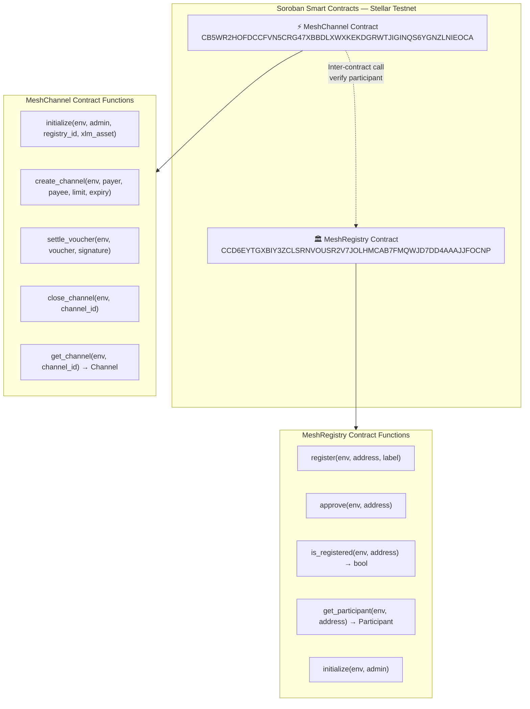
```mermaid
graph TB
    subgraph CONTRACTS["Soroban Smart Contracts — Stellar Testnet"]
        direction TB
        REGISTRY["🏛️ MeshRegistry Contract\nCCD6EYTGXBIY3ZCLSRNVOUSR2V7JOLHMCAB7FMQWJD7DD4AAAJJFOCNP"]
        CHANNEL["⚡ MeshChannel Contract\nCB5WR2HOFDCCFVN5CRG47XBBDLXWXKEKDGRWTJIGINQS6YGNZLNIEOCA"]
    end

    subgraph REGISTRY_FUNCS["MeshRegistry Contract Functions"]
        RF1["register(env, address, label)"]
        RF2["approve(env, address)"]
        RF3["is_registered(env, address) → bool"]
        RF4["get_participant(env, address) → Participant"]
        RF5["initialize(env, admin)"]
    end

    subgraph CHANNEL_FUNCS["MeshChannel Contract Functions"]
        CF1["initialize(env, admin, registry_id, xlm_asset)"]
        CF2["create_channel(env, payer, payee, limit, expiry)"]
        CF3["settle_voucher(env, voucher, signature)"]
        CF4["close_channel(env, channel_id)"]
        CF5["get_channel(env, channel_id) → Channel"]
    end

    REGISTRY --> REGISTRY_FUNCS
    CHANNEL --> CHANNEL_FUNCS
    CHANNEL -.->|"Inter-contract call\nverify participant"| REGISTRY

    classDef contractStyle fill:#2a1a3a,stroke:#e84142,color:#fff,rx:8px
```

### Channel Creation Flow (On-Chain)

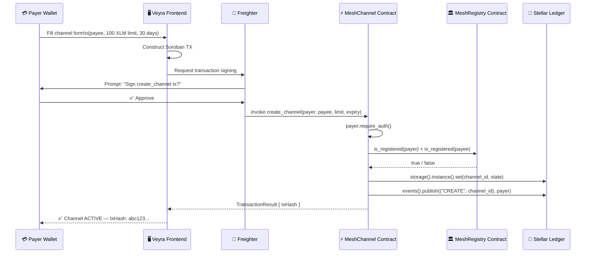
```mermaid
sequenceDiagram
    participant PAYER as 💳 Payer Wallet
    participant FE as 🖥️ Veyra Frontend
    participant FREIGHTER as 🔑 Freighter
    participant CHANNEL as ⚡ MeshChannel Contract
    participant REGISTRY as 🏛️ MeshRegistry Contract
    participant LEDGER as 📖 Stellar Ledger

    PAYER->>FE: Fill channel form\n(payee, 100 XLM limit, 30 days)
    FE->>FE: Construct Soroban TX
    FE->>FREIGHTER: Request transaction signing
    FREIGHTER->>PAYER: Prompt: "Sign create_channel tx?"
    PAYER->>FREIGHTER: ✅ Approve
    FREIGHTER->>CHANNEL: invoke create_channel(payer, payee, limit, expiry)
    CHANNEL->>CHANNEL: payer.require_auth()
    CHANNEL->>REGISTRY: is_registered(payer) + is_registered(payee)
    REGISTRY-->>CHANNEL: true / false
    CHANNEL->>LEDGER: storage().instance().set(channel_id, state)
    CHANNEL->>LEDGER: events().publish(("CREATE", channel_id), payer)
    CHANNEL-->>FE: TransactionResult { txHash }
    FE-->>PAYER: ✅ Channel ACTIVE — txHash: abc123...
```

### Offline Voucher Settlement Flow

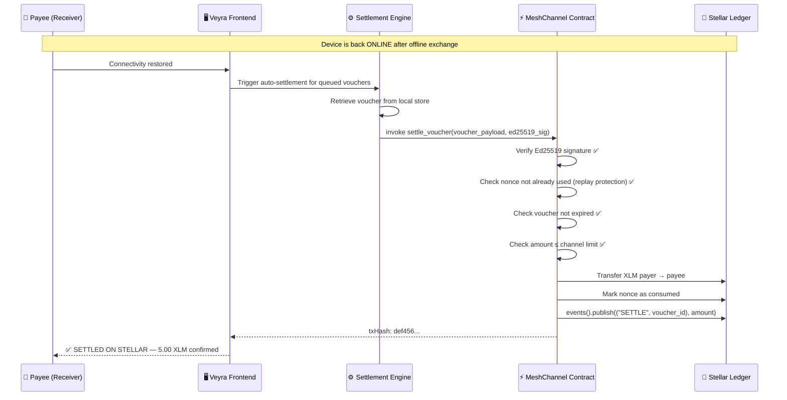
```mermaid
sequenceDiagram
    participant PAYEE as 🎯 Payee (Receiver)
    participant FE as 🖥️ Veyra Frontend
    participant ENGINE as ⚙️ Settlement Engine
    participant CHANNEL as ⚡ MeshChannel Contract
    participant LEDGER as 📖 Stellar Ledger

    Note over PAYEE,LEDGER: Device is back ONLINE after offline exchange
    PAYEE->>FE: Connectivity restored
    FE->>ENGINE: Trigger auto-settlement for queued vouchers
    ENGINE->>ENGINE: Retrieve voucher from local store
    ENGINE->>CHANNEL: invoke settle_voucher(voucher_payload, ed25519_sig)
    CHANNEL->>CHANNEL: Verify Ed25519 signature ✅
    CHANNEL->>CHANNEL: Check nonce not already used (replay protection) ✅
    CHANNEL->>CHANNEL: Check voucher not expired ✅
    CHANNEL->>CHANNEL: Check amount ≤ channel limit ✅
    CHANNEL->>LEDGER: Transfer XLM payer → payee
    CHANNEL->>LEDGER: Mark nonce as consumed
    CHANNEL->>LEDGER: events().publish(("SETTLE", voucher_id), amount)
    CHANNEL-->>FE: txHash: def456...
    FE-->>PAYEE: ✅ SETTLED ON STELLAR — 5.00 XLM confirmed
```

### Voucher Status Lifecycle

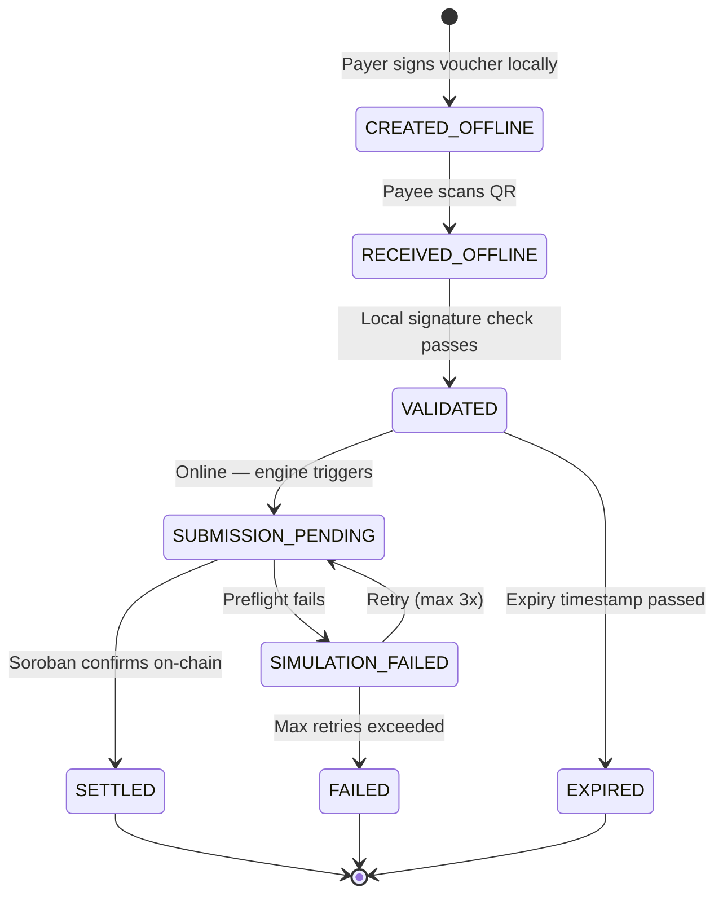
```mermaid
stateDiagram-v2
    [*] --> CREATED_OFFLINE : Payer signs voucher locally
    CREATED_OFFLINE --> RECEIVED_OFFLINE : Payee scans QR
    RECEIVED_OFFLINE --> VALIDATED : Local signature check passes
    VALIDATED --> SUBMISSION_PENDING : Online — engine triggers
    SUBMISSION_PENDING --> SETTLED : Soroban confirms on-chain
    SUBMISSION_PENDING --> SIMULATION_FAILED : Preflight fails
    SIMULATION_FAILED --> SUBMISSION_PENDING : Retry (max 3x)
    SIMULATION_FAILED --> FAILED : Max retries exceeded
    VALIDATED --> EXPIRED : Expiry timestamp passed
    SETTLED --> [*]
    FAILED --> [*]
    EXPIRED --> [*]
```

---

## 🔐 Security Model

### Threat Model & Protections

| Threat | Protection Mechanism |
|:---|:---|
| 🔄 **Replay Attack** | Soroban nonce tracking — each voucher ID consumed exactly once on-chain |
| 💰 **Altered Amount** | Ed25519 signature over canonical payload — any change = invalid sig |
| 👤 **Wrong Recipient** | On-chain payee address check inside `settle_voucher` |
| ⏰ **Expired Voucher** | On-chain timestamp check — Soroban rejects stale vouchers |
| ♻️ **Double Settlement** | Idempotency key + nonce consumed on first successful settlement |
| 🔑 **Secret Key Exposure** | Never stored anywhere — Freighter signs in-memory only |
| 🎭 **Fake Confirmation** | UI only shows `SETTLED` after verified on-chain Soroban event |
| 🚫 **Malicious QR** | Strict schema validation + signature check before any state change |
| 🏦 **Channel Overdraft** | `amount ≤ channel.limitAmount` enforced in Soroban contract |
| 👥 **Unregistered Participant** | MeshChannel calls MeshRegistry to verify both parties on-chain |

### Settlement Honesty Guarantee

Veyra **never** claims an offline payment is settled until the Soroban contract confirms it on the Stellar ledger. The UI makes the full lifecycle visible at all times:

```
  CREATED_OFFLINE  →  RECEIVED_OFFLINE  →  VALIDATED
                                               ↓
                                    SUBMISSION_PENDING
                                       ↙         ↘
                               SETTLED ✅     FAILED ❌
                               EXPIRED ⏰
```

There is no optimistic UI. There is no fake "confirmed" screen. Every status change is driven by real contract state.

---

## 🎥 Demo Script (90 seconds)

### Scene 1 — Connect Wallet
1. Open Veyra → beautiful landing page with live background video
2. Click **Launch App** → Dashboard loads with real ledger data in the top bar

### Scene 2 — Create Payment Channel
1. Sidebar → **Channels** → **+ New Channel**
2. Enter recipient's Stellar address, set **100 XLM** limit, **30 days** expiry
3. Click through the multi-step wizard → **Review** → **Create Channel**
4. Freighter pops up → approve → real transaction submitted to Soroban

### Scene 3 — Go Offline
1. **Settings** → toggle **Simulate Offline Mode** ON
2. Top bar shows: `● OFFLINE — Ledger 44,224,984`

### Scene 4 — Create Offline Voucher
1. Sidebar → **Payments** → select the active channel → enter **25 XLM**
2. Click **Generate Offline Voucher**
3. QR code appears with full signed payload — Ed25519 signature included

### Scene 5 — Receive Voucher
1. Sidebar → **Receive** → Scan QR (or paste payload)
2. Validation runs locally — zero internet needed:
   ```
   ● VOUCHER LOCALLY VALIDATED
   25.00 XLM  |  Alice → Bob
   Signature: VALID ✅  |  Expiry: 72h remaining
   ```
3. Click **Save for Settlement**

### Scene 6 — Reconnect & Settle
1. Toggle **Offline Mode** OFF
2. Settlement Engine automatically runs in the background
3. Sidebar → **Activity** → voucher shows `SETTLED ON STELLAR`
4. Click the external link icon → opens Stellar Expert with the real on-chain tx

### Scene 7 — Block Explorer Proof
Real transaction hash on `stellar.expert/explorer/testnet/tx/...` — immutable, public, verifiable by anyone.

---

<a name="contracts"></a>
## 🔗 Deployed Contracts — Stellar Testnet

| Contract | Address | Explorer |
|:---|:---|:---|
| **MeshRegistry** | `CCD6EYTGXBIY3ZCLSRNVOUSR2V7JOLHMCAB7FMQWJD7DD4AAAJJFOCNP` | [View on Stellar Expert ↗](https://stellar.expert/explorer/testnet/contract/CCD6EYTGXBIY3ZCLSRNVOUSR2V7JOLHMCAB7FMQWJD7DD4AAAJJFOCNP) |
| **MeshChannel** | `CB5WR2HOFDCCFVN5CRG47XBBDLXWXKEKDGRWTJIGINQS6YGNZLNIEOCA` | [View on Stellar Expert ↗](https://stellar.expert/explorer/testnet/contract/CB5WR2HOFDCCFVN5CRG47XBBDLXWXKEKDGRWTJIGINQS6YGNZLNIEOCA) |

> [!NOTE]
> Both contracts are deployed and initialized on **Stellar Testnet**. The MeshChannel contract is linked to the MeshRegistry contract at initialization time and calls it on every settlement to verify participant registration.

---

## 🛠️ Tech Stack

### Frontend
| Technology | Version | Purpose |
|:---|:---|:---|
| **React** | 18.x | Component-based UI framework |
| **TypeScript** | 5.x | Type-safe frontend development |
| **Vite** | 5.x | Lightning-fast build tool + HMR |
| **Tailwind CSS** | 3.x | Utility-first styling system |
| **Zustand** | 4.x | Lightweight global state management |
| **React Router** | 6.x | Client-side routing |
| **Lucide React** | Latest | Icon system |

### Blockchain
| Technology | Version | Purpose |
|:---|:---|:---|
| **Rust** | 1.75+ | Soroban smart contract language |
| **Soroban SDK** | 22.x | Stellar smart contract framework |
| **Stellar SDK (JS)** | Latest | Frontend blockchain interactions |
| **Freighter API** | Latest | Browser wallet integration |
| **@stellar/stellar-sdk** | Latest | Transaction construction + RPC |

### Packages
| Package | Purpose |
|:---|:---|
| `@stellar-mesh/shared` | Shared TypeScript domain types and constants |
| `@stellar-mesh/voucher-protocol` | Canonical voucher serialization + Ed25519 validation |
| `@stellar-mesh/stellar-client` | Freighter integration + typed RPC client |

### DevOps
| Technology | Purpose |
|:---|:---|
| **GitHub Actions** | CI/CD — automated `cargo test` + frontend build |
| **Vercel** | Frontend deployment with automatic Git integration |
| **Stellar CLI** | Contract build, deploy, invoke |

### 💳 Supported Wallets
- **Freighter Wallet** ⭐ (Recommended — full Soroban transaction signing support)

---

## 🧪 CI/CD Pipeline

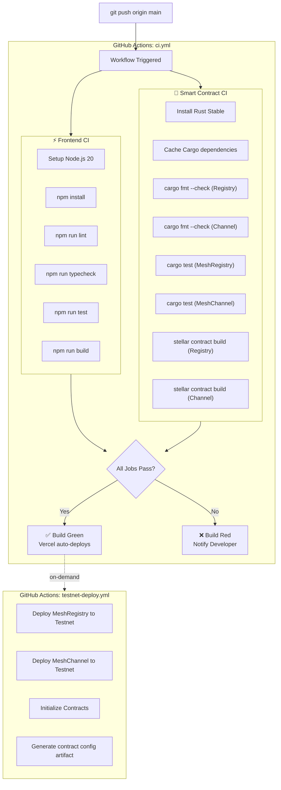
```mermaid
graph TD
    PUSH["git push origin main"]

    subgraph GITHUB_ACTIONS["GitHub Actions: ci.yml"]
        TRIGGER["Workflow Triggered"]

        subgraph FRONTEND_JOB["⚡ Frontend CI"]
            F1["Setup Node.js 20"]
            F2["npm install"]
            F3["npm run lint"]
            F4["npm run typecheck"]
            F5["npm run test"]
            F6["npm run build"]
        end

        subgraph CONTRACT_JOB["🦀 Smart Contract CI"]
            C1["Install Rust Stable"]
            C2["Cache Cargo dependencies"]
            C3["cargo fmt --check (Registry)"]
            C4["cargo fmt --check (Channel)"]
            C5["cargo test (MeshRegistry)"]
            C6["cargo test (MeshChannel)"]
            C7["stellar contract build (Registry)"]
            C8["stellar contract build (Channel)"]
        end

        RESULT{All Jobs Pass?}
        SUCCESS["✅ Build Green\nVercel auto-deploys"]
        FAIL["❌ Build Red\nNotify Developer"]
    end

    subgraph DEPLOY_WORKFLOW["GitHub Actions: testnet-deploy.yml"]
        D1["Deploy MeshRegistry to Testnet"]
        D2["Deploy MeshChannel to Testnet"]
        D3["Initialize Contracts"]
        D4["Generate contract config artifact"]
    end

    PUSH --> TRIGGER
    TRIGGER --> FRONTEND_JOB
    TRIGGER --> CONTRACT_JOB
    FRONTEND_JOB --> RESULT
    CONTRACT_JOB --> RESULT
    RESULT -->|Yes| SUCCESS
    RESULT -->|No| FAIL
    SUCCESS -.->|"on-demand"| DEPLOY_WORKFLOW
```

---

<a name="roadmap"></a>
## 🚧 Roadmap & Future Plans

### Development Timeline

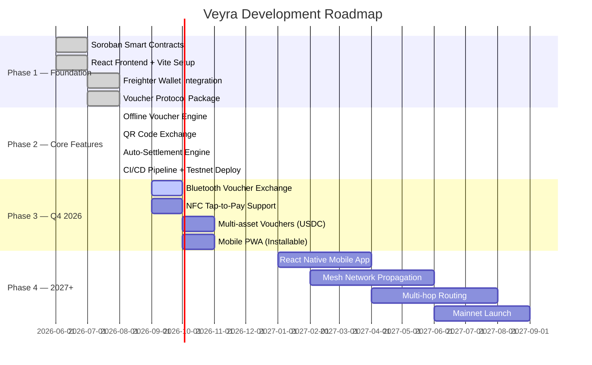
```mermaid
gantt
    title Veyra Development Roadmap
    dateFormat  YYYY-MM
    section Phase 1 — Foundation
    Soroban Smart Contracts          :done, p1a, 2026-06, 2026-07
    React Frontend + Vite Setup      :done, p1b, 2026-06, 2026-07
    Freighter Wallet Integration     :done, p1c, 2026-07, 2026-08
    Voucher Protocol Package         :done, p1d, 2026-07, 2026-08

    section Phase 2 — Core Features
    Offline Voucher Engine           :done, p2a, 2026-08, 2026-08
    QR Code Exchange                 :done, p2b, 2026-08, 2026-08
    Auto-Settlement Engine           :done, p2c, 2026-08, 2026-08
    CI/CD Pipeline + Testnet Deploy  :done, p2d, 2026-08, 2026-08

    section Phase 3 — Q4 2026
    Bluetooth Voucher Exchange       :active, p3a, 2026-09, 2026-10
    NFC Tap-to-Pay Support           :        p3b, 2026-09, 2026-10
    Multi-asset Vouchers (USDC)      :        p3c, 2026-10, 2026-11
    Mobile PWA (Installable)         :        p3d, 2026-10, 2026-11

    section Phase 4 — 2027+
    React Native Mobile App          :        p4a, 2027-01, 2027-04
    Mesh Network Propagation         :        p4b, 2027-02, 2027-06
    Multi-hop Routing                :        p4c, 2027-04, 2027-08
    Mainnet Launch                   :        p4d, 2027-06, 2027-09
```

### Phase 3 — Immediate Next Features

| Priority | Feature | ETA |
|:---:|:---|:---|
| 🔴 | Bluetooth Low Energy voucher exchange (no internet AND no QR) | Q4 2026 |
| 🔴 | NFC tap-to-pay support for compatible devices | Q4 2026 |
| 🟡 | Multi-asset support (USDC, custom Stellar tokens) | Q4 2026 |
| 🟡 | Voucher expiry notification system | Q4 2026 |
| 🟢 | Batch settlement — settle multiple vouchers in one transaction | Q4 2026 |
| 🟢 | Mobile PWA — fully installable, works on any smartphone | Q4 2026 |

### Phase 4 — Platform Maturity

- **Mesh Network**: Device-to-device propagation of vouchers across multiple hops — no internet at all
- **Multi-hop Routing**: Alice pays Carol via Bob, even when Alice and Carol cannot communicate directly
- **React Native App**: Native iOS and Android application with BLE and NFC built in
- **Mainnet Launch**: Production deployment on Stellar Mainnet with real XLM and audited contracts

---

<a name="quick-start"></a>
## ⚙️ Quick Start

### Prerequisites

```bash
# 1. Install Node.js 20+
# https://nodejs.org

# 2. Install Rust
curl --proto '=https' --tlsv1.2 -sSf https://sh.rustup.rs | sh

# 3. Add WASM target
rustup target add wasm32v1-none

# 4. Install Stellar CLI
cargo install --locked stellar-cli --features opt

# 5. Install Freighter browser extension
# https://freighter.app — switch to Testnet
```

### Smart Contract Setup

```bash
# Clone the repository
git clone https://github.com/riyadevs948-alt/StellarMesh.git
cd StellarMesh

# Run all contract tests
cd contracts/mesh-registry && cargo test
cd ../mesh-channel && cargo test

# Build contracts
stellar contract build  # run inside each contract directory

# Deploy to testnet (automated via CI/CD)
export STELLAR_DEPLOYER_SECRET=S...
chmod +x scripts/deploy.sh
./scripts/deploy.sh
```

### Frontend Setup

```bash
# Install all dependencies (monorepo)
npm install

# Copy environment variables
cp .env.example apps/web/.env.local
# Fill in:
# VITE_MESH_REGISTRY_CONTRACT_ID=CCD6EYTGXBIY3ZCLSRNVOUSR2V7JOLHMCAB7FMQWJD7DD4AAAJJFOCNP
# VITE_MESH_CHANNEL_CONTRACT_ID=CB5WR2HOFDCCFVN5CRG47XBBDLXWXKEKDGRWTJIGINQS6YGNZLNIEOCA

# Run development server
npm run dev -w apps/web
# → Open http://localhost:5173
```

### Environment Variables

```env
# Stellar Network
VITE_STELLAR_NETWORK=testnet
VITE_STELLAR_RPC_URL=https://soroban-testnet.stellar.org
VITE_STELLAR_NETWORK_PASSPHRASE="Test SDF Network ; September 2015"
VITE_STELLAR_HORIZON_URL=https://horizon-testnet.stellar.org
VITE_EXPLORER_BASE_URL=https://stellar.expert/explorer/testnet

# Deployed Contract IDs
VITE_MESH_REGISTRY_CONTRACT_ID=CCD6EYTGXBIY3ZCLSRNVOUSR2V7JOLHMCAB7FMQWJD7DD4AAAJJFOCNP
VITE_MESH_CHANNEL_CONTRACT_ID=CB5WR2HOFDCCFVN5CRG47XBBDLXWXKEKDGRWTJIGINQS6YGNZLNIEOCA
```

### GitHub Secrets Required for CI/CD

| Secret | Purpose |
|:---|:---|
| `STELLAR_DEPLOYER_SECRET` | Deployer account private key for contract deployment |
| `VERCEL_TOKEN` | Vercel deployment authentication token |

---

## 📸 Appendix: Project Screenshots & Proof of Work

<details>
<summary><b>1. Frontend Application Screenshots</b></summary>
<br/>


</details>

<details>
<summary><b>2. Mobile Responsive Proof</b></summary>
<br/>

<div style="display: flex; gap: 10px; flex-wrap: wrap;">
  
  
  
  
</div>

</details>

<details>
<summary><b>3. Smart Contract Deployment & Verification</b></summary>
<br/>


</details>

<details>
<summary><b>4. Blockchain Transaction Proof (Settlement)</b></summary>
<br/>


</details>

<details>
<summary><b>5. Unit Testing & CI/CD Pipeline</b></summary>
<br/>


</details>

---

## 👨‍💻 Author

**Riya Mukherjee**
- Blockchain Developer | Soroban Specialist | Full-Stack Engineer
- [GitHub Repository](https://github.com/riyadevs948-alt/StellarMesh)

---

## 📜 License

This project is licensed under the MIT License.

---

<div align="center">

> **Network:** Stellar Testnet | **Last Updated:** August 2026
>
> Built with ❤️ on Stellar Soroban — *The blockchain built for the real world.*
>
> *Pay offline. Settle on Stellar.*

</div>
